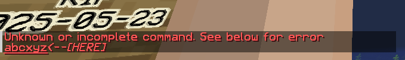
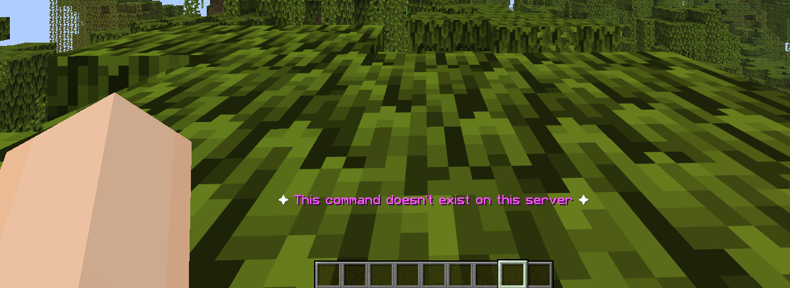

# ⚡ VShildV

A simple and lightweight Paper plugin that removes "unknown command" chat spam and replaces it with a clean ActionBar message.

---

## 📌 What it does

When a player types a wrong command like:
`/abcxyz`
---

Instead of showing Minecraft chat error:

- 

----
It shows a clean ActionBar message:

- 


---

## ✨ Features

- Removes default unknown command chat error
- Shows ActionBar message instead
- Clean white + purple style message
- Lightweight and fast
- Simple enable/disable system
- Easy configuration

---

## 🧾 Commands

### Admin Commands
- `/vsv enable` → Enable plugin
- `/vsv disable` → Disable plugin
- `/vsv reload` → Reload config


### Player Commands
- `/vsv help` → Show help menu
- `/vsv support` → Support link


---

## 🔐 Permission
- `vsv.admin`


Default: OP only

---
## ⚙️ Config

```yaml
enabled: true
```
---
### 👤 Author

- `Notvoid18`

### ❤️ Support

`https://kamauchanepali.com/tip/notvoid/`

### 🚀 Purpose

Make Minecraft servers cleaner by removing unnecessary chat errors and replacing them with modern UI feedback.

